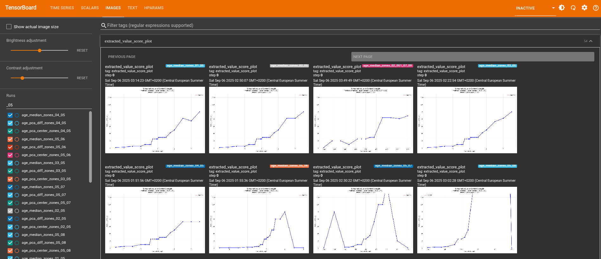
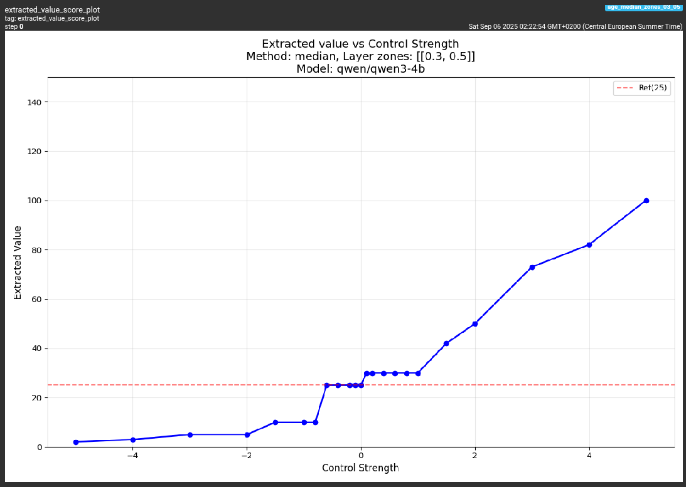
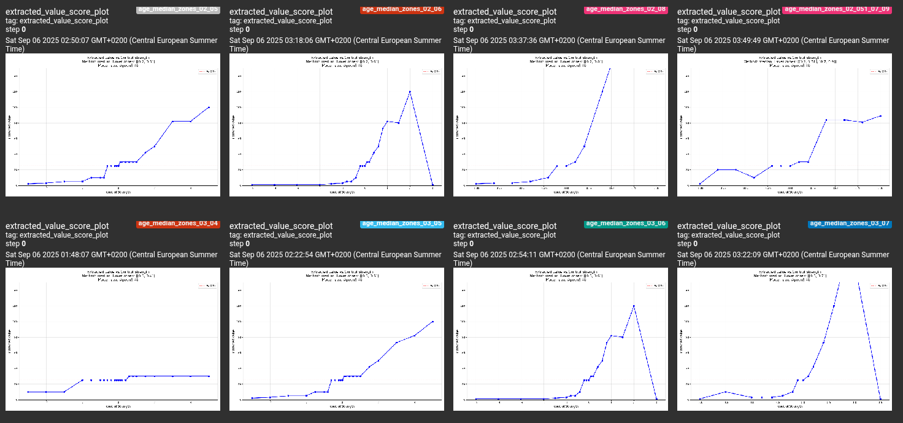
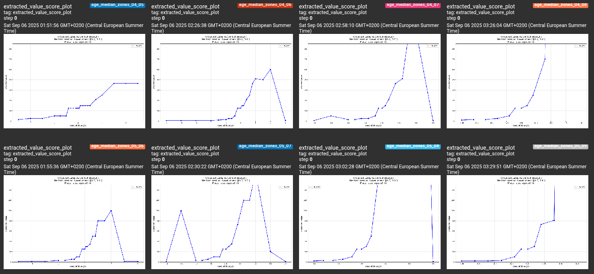
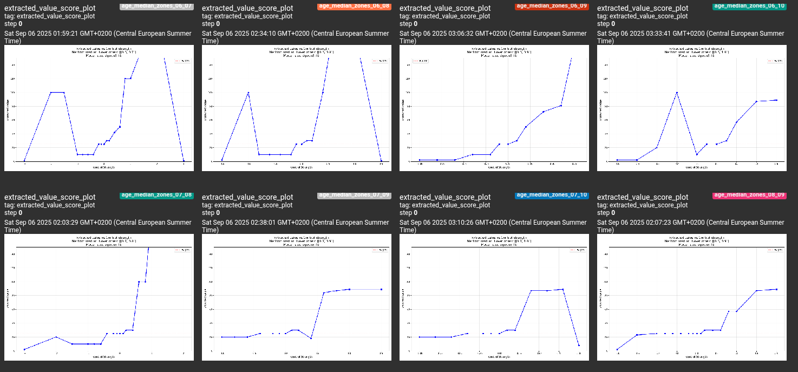

# repeng - Research Fork

**This is an experimental repo where I experiment with [repeng](https://github.com/vgel/repeng). It was made to organise the questions mentioned [in this issue](https://github.com/vgel/repeng/issues/27), [pr](https://github.com/vgel/repeng/pull/55) and [pr](https://github.com/vgel/repeng/pull/65).**

# Notes
- Don't hesitate to reach out!
- This is an experimental repo, that I occasionaly push to.
- I'm also doing this to keep track of what I do.
- All new features of this fork I intend to send upstream.
- I don't plan on using the SAE as I don't understand it.

# Fork Features

For this project I had to make substantial modifications to repeng:
- Currently waiting for upstream approval:
    - [PR 66](https://github.com/vgel/repeng/pull/66):
        - Make repeng compatible with qwen3 models ([link](https://github.com/vgel/repeng/pull/66))
    - [PR 65](https://github.com/vgel/repeng/pull/65):
        - support for input in the "chat" format instead of strings.
        - layers zones (make it easier to specify the layers to control)
        - autocorrecting templates of models
- I have terrible old hardware so the memory requirements were an issue for me. So I implemented with [h5py](https://pypi.org/project/h5py/) a caching of the hidden layers activations to avoid recomputing them each time. Also, there is now no need to hold all the activations in memory at the same time, we only hold one layer at a time.
    - Also modified the `transform_hidden` function so that we don't have to hold all the layers in memory at the same time, just one at a time.
- Implemented new `methods` to get the directions of the vector:
    - `mean`: simply do `np.mean` on the positive samples, then on the negative, and substract the two.
    - `median`: same as `np.mean` but with `np.median`.
    - `custom`: accepts any function to transform the hidden layers.
- Added optional [beartype](https://beartype.readthedocs.io/) runtime type checking.
- Wrote `./repeng/research/datasets.py` to organize example datasets for repeng.
- Added some [loguru](https://pypi.org/project/loguru/) logging.

# Current plan:

1. **Write a calibration suite**
    - For a specific model initially
        - Current best choice is `qwen/qwen3-4b` because it's small and *okay*. And I have terrible hardware. If you're rich and want to send me a GPU I would make great use of it!
    - if you give pairs of "dumb/smart" then ask for the model to estimate its IQ, it's easy to parse the answer to measure which layers to target and by how much etc
        - same idea with "young/old" then ask to estimate its age.
            - *Note: I was hopeful about that one but LLMs are too stuborn and insist that they are born in like 2023 or something.*
                - Actually, By asking the LLM to imagine being a human, and asked the age of that human it works.
        - same idea with "sad/happy" then ask to estimate its [BDI](https://en.wikipedia.org/wiki/Beck_Depression_Inventory) or [PHQ-9](https://en.wikipedia.org/wiki/PHQ-9) score.
        - and so on
    - we can then answer:
        1. Is the "best layer" stable across experiments
        2. Is the "best layer"'s sensitivity (strength wise) stable across experiments
        3. Is the "best layer" about the same for different size of distilled models? (gemma models)
        3. Is the "best layer" about the same for different model families? (mistral vs gemma vs llama)
        4. What is the impact of the number of samples on the reliability of those effects?
        5. What is the impact of quantization on this effect?
        6. What is the impact of longer context on this effect? And of thinking? Does the influence get amplified, fades away or is stable?
        7. Do MoE models behave differently?

2. **Redo this whole experience but comparing between vector extraction methods:**
    - mean (the mean value of positive samples - mean value of negative samples)
    - median (the median value of positive samples - median value of negative samples)
    - [PCA](https://scikit-learn.org/stable/modules/decomposition.html)
        - pca_diff
        - pca_center
    - [kPCA](https://scikit-learn.org/stable/modules/decomposition.html)
    - [dictionary learning](https://scikit-learn.org/stable/modules/decomposition.html)
    - [ICA](https://scikit-learn.org/stable/modules/decomposition.html)
    - [NMF](https://scikit-learn.org/stable/modules/decomposition.html)
    - [UMAP](https://umap-learn.readthedocs.io/en/latest/)
    - [UMAP with densmap](https://umap-learn.readthedocs.io/en/latest/densmap_demo.html)
    - [pacmap](https://github.com/YingfanWang/PaCMAP/)

The idea is to do a grid_search (with taguchi reduction using my other project [TaguchiGridSearchConverted](https://pypi.org/project/taguchigridsearchconverter/) and store all the data into [tensorboard](https://www.tensorflow.org/tensorboard).

# Results

You are in the `./results` folder, where the results of research are stored.

## Result Folder Organization

In `./results` are two folders: `reproductible_scripts/` and `tensorboard_logs/`. The scripts are appended with a commit hash (e.g. `grid_search_8f8a13d0bd468afbf6ea10e33005ec62c05e7e20.py`), this hash corresponds to a commit in the `research_setup` branch.
Unless stated otherwise, the model used is `qwen/qwen3-4b`, with quantization.
- To reproduce the result:
    - create a new git branch, reset to that commit, then run via `python ./repeng/research/grid_search.py`.
        - Or to avoid dealing with branches, just move the script to `./repeng/research/grid_search.py`, execute it with `python ./repeng/research/grid_search.py`
    - To open the results, use `tensorboard --logdir ./result/tensorboard_logs/some_dir`. The output will contain a link like `TensorBoard 2.20.0 at http://localhost:6006/` that you must open in a browser.

## How to read the results

When opening tensorboard, you are greeted with an interface similar to this.

Our main interest here will be the `images` section. Let's take this one for example:

In the top right corner of the image, you can see in blue the name of that image when it was recorded: `age_median_zones_03_05`. Let's break down what it means.
- The horizontal axis is the `strength` we gave the vector (i.e. by how much we multiply it).
- The vertical axis is the value we extracted from the LLM's answer. The type of which depends on the dataset but here is the age picked by the model.
- `age_` refers to the dataset, prompt and topic of the vector used.
    - In the `age` dataset, we create a `young<->old` vector then ask the model to imagine being a human, then ask it the age of that human (that's because if you just ask the model its age it will answer that it was created in 2023 or something).  Ideally, with a higher vector strength, we want the model to answer that it's very old, and with a negative strength we want the model to answer that it's young.
    - There is also `iq` dataset, where we create a `stupid<->smart` vector, then ask the model its iq.
- `_median_` refers to the method used to extract the vector.
- `_zones_` means that we used the `layer_zones` argument instead of `layer_ids`.
- `_03_05` means that the `layer_zones` argument was `layer_zones=[[0.3, 0.5]]`. Meaning that the layers controlled are with a depth between 30% (inclusive) and 50% (not included). `_03_05_07_08` would have meant that two zones were controlled: `[0.3, 0.5]` and `[0.7, 0.8]`.

- For plotting reasons, note that when the model completely breaks down (answers gibberish), we treat it as if it answered `0`. This is because tensorboard and matplotlib are not handling well `np.nan` type numbers.

So, let's take a global look to all `age_median_` (using the filter on the left) and start doing interpretations.

## Interpretations and conclusion

- The ideal figure would basically be a straight `y=x` line, as it would mean that we can *reliably* control the vector, and by how much. The *straightness* is important as it indicates a linear effect relationship, which is essential for controlling carefully the model.
- When instead of a line, we have a sort of *mountain*, that means that the LLM broke down (answer is parsed as 0) at extreme values of strength. The narrower the mountain, the less strength abilities we have.
- If we have a line, a steep slope means the chosen layers are particularly sensitive to our vector. Which is not necessarily a bad thing but I chose the range of `strengths` values after estimating the dose-response curve and not randomly.
- A flat line usually means that the model barely (if at all) responded to the vector. Indeed, without any vector, the IQ answered by the LLM is around 125, and the age is 25.

Let's first look at plots that affect the extremes.
- controlling layers `_09_10` (the very deepest) seems to barely affect the model.

If you look at those who control until `_08`, vs until `_07`, `_06` etc until `_0.5`. It seems that the deeper we control, the more brittle the model is. Put another way: controlling deeper layers makes the model break down at lower strengths.

If you look at those who control starting from `_01`, vs at `_02`, `_03` etc until `_0.5`. It seems that the first we layers are about as responsive as the deepest (i.e. not very responsive).

Click to read older ideas

- Benchmark the model using langtest to get its reference scores on things like MMLU
- do the following comparisons also with the instruct vs base versions
- Run the benchmark again after applying the following vector to measure how badly we crippled the LLM:
    - Apply only to some layers and see how much it impacts the benchmarks
    - with 100 samples:
        - PCA
        - pacmap
        - UMAP
        - UMAP with densmap
        - PCA + 0.3 * pacmap
        - PCA + 0.3 * UMAP
        - PCA + 0.3 * UMAP with densmap
    - Again with 1000 samples
    - Again with normalization of each directions (=rescaling to have max size of 1, or applying L1, or L2)
    - Again with all layers, only the middle half layers, only the last half
    - Keep 10 UMAP dimensions, do a kmeans with k=5, apply the repeng using as vector the 1D pca of only the points in the first cluster, do that for each clusters and see if they all have a strong effect of not
    - Create a pair of good and bad intelligence-aligned examples, see if it increases its accuracy on other similar benchmarks
    - Create a pair of good and bad answers to the MMLU, see if it increases its accuracy on other similar benchmarks

# How to replicate my setup
- git clone this repo
- cd into it
- `uv venv` then activate the venv
- install my slightly modified repeng into the venv with `uv pip install -e .`
- Install new dependencies from `./repeng/research/requirements.txt` with `uv pip install -r ./repeng/research/requirements.txt`
- Also might be needed:
    - installing `umap-learn` by following [those instructions](https://pypi.org/project/umap-learn/)
    - installing `pacmap` by following [those instructions](https://pypi.org/project/pacmap/)
