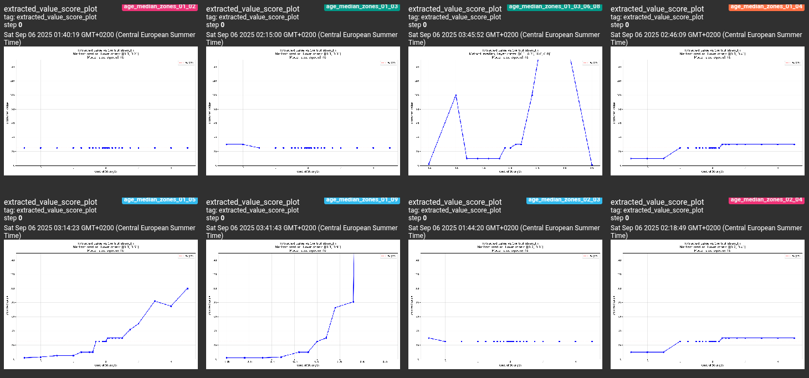
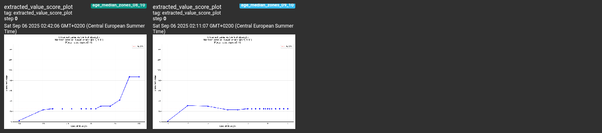

# Result folder

You are in the `./results` folder, where the results of research are stored.

## Result Folder Organization

In `./results` are two folders: `reproductible_scripts/` and `tensorboard_logs/`. The scripts are appended with a commit hash (e.g. `grid_search_8f8a13d0bd468afbf6ea10e33005ec62c05e7e20.py`), this hash corresponds to a commit in the `research_setup` branch.
- To reproduce the result:
    - create a new git branch, reset to that commit, then run via `python ./repeng/research/grid_search.py`.
        - Or to avoid dealing with branches, just move the script to `./repeng/research/grid_search.py`, execute it with `python ./repeng/research/grid_search.py`
    - To open the results, use `tensorboard --logdir ./result/tensorboard_logs/some_dir`. The output will contain a link like `TensorBoard 2.20.0 at http://localhost:6006/` that you must open in a browser.

## How to read the results

When opening tensorboard, you are greeted with an interface similar to this.

Our main interest here will be the `images` section. Let's take this one for example:

In the top right corner of the image, you can see in blue the name of that image when it was recorded: `age_median_zones_03_05`. Let's break down what it means.
- The horizontal axis is the `strength` we gave the vector (i.e. by how much we multiply it).
- The vertical axis is the value we extracted from the LLM's answer. The type of which depends on the dataset but here is the age picked by the model.
- `age_` refers to the dataset, prompt and topic of the vector used.
    - In the `age` dataset, we create a `young<->old` vector then ask the model to imagine being a human, then ask it the age of that human (that's because if you just ask the model its age it will answer that it was created in 2023 or something).  Ideally, with a higher vector strength, we want the model to answer that it's very old, and with a negative strength we want the model to answer that it's young.
    - There is also `iq` dataset, where we create a `stupid<->smart` vector, then ask the model its iq.
- `_median_` refers to the method used to extract the vector.
- `_zones_` means that we used the `layer_zones` argument instead of `layer_ids`.
- `_03_05` means that the `layer_zones` argument was `layer_zones=[[0.3, 0.5]]`. Meaning that the layers controlled are with a depth between 30% (inclusive) and 50% (not included). `_03_05_07_08` would have meant that two zones were controlled: `[0.3, 0.5]` and `[0.7, 0.8]`.

So, let's take a global look to all `age_median_` (using the filter on the left) and start doing interpretations.

